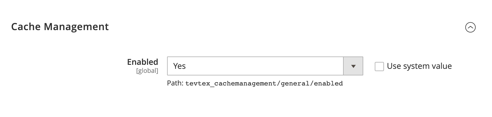

# Magento 2 Cache Management API

> Module to enable cache management in Magento 2 using API.

It adds the following API endpoints to your Magento application:


## API Endpoints

> Enable all or specific cache types
 
```
PUT /V1/tevtex/cache/enable

(Optionally pass the cache types to enable, defaults to all cache types)
{
  "cache_types":[
    "eav",
    "config",
  ]
}
```

> Disable all cache types

```
PUT /V1/tevtex/cache/disable

(Optionally pass the cache types to disable, defaults to all cache types)
{
  "cache_types":[
    "eav",
    "config",
  ]
}
```

> Clean all or specific cache types.

```
POST /V1/tevtex/cache/clean

(Optionally pass the cache types to clean, defaults to all cache types)
{
  "cache_types":[
    "eav",
    "config",
    ...
  ]
}
```

> Flush all or specific cache types.

```
POST /V1/tevtex/cache/flush

(Optionally pass the cache types to flush, defaults to all cache types)
{
    "cache_types":[
        "eav",
        "config",
        ...
    ]
}
```

**Note**: The API endpoints are secured and require the `Magento_Backend::cache` resource access right for authorization.

## Installation

> Simply run the following command to install the module using `composer`

```bash
composer require tevtex/module-cachemanagement
```

## Usage

> Enable the module using following command:

```bash
bin/magento module:enable Tevtex_CacheManagement
bin/magento setup:upgrade
```

> Enable the configuration using one of the following ways:

### Using Admin Panel

> Visit the following location in admin panel and enable the module

```bash
Stores > Configuration > TEVTEX > Cache Management > General > Enabled
```



### Using Command Line

> Run the following command to enable the module

```bash
bin/magento config:set tevtex_cachemanagement/general/enabled 1
```

## Contribute

Feel free to submit pull requests, create issues or spread the word.

## License 

MIT &copy; [Ahmad Farzan](https://github.com/farzanahmad)
